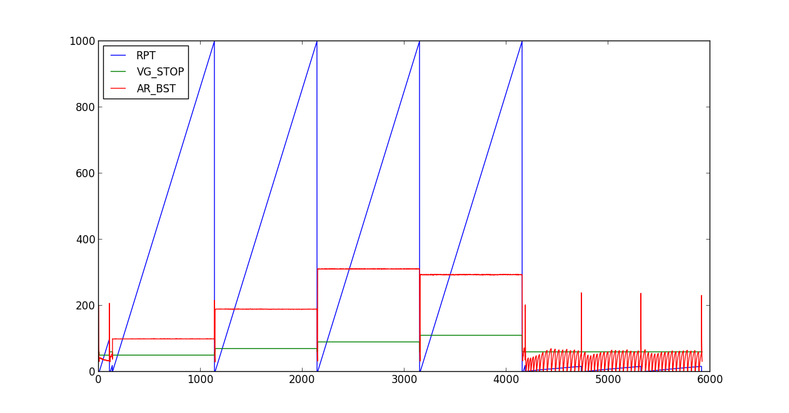
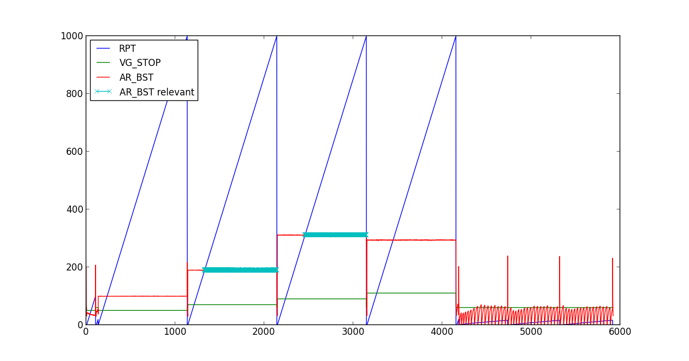
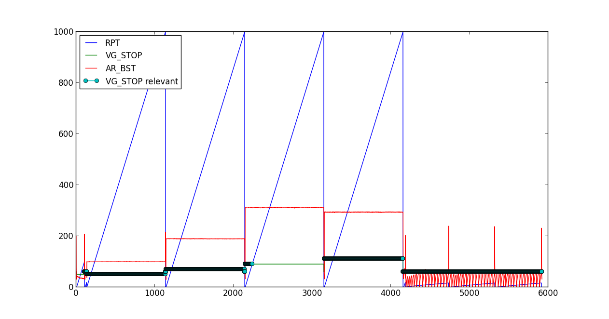
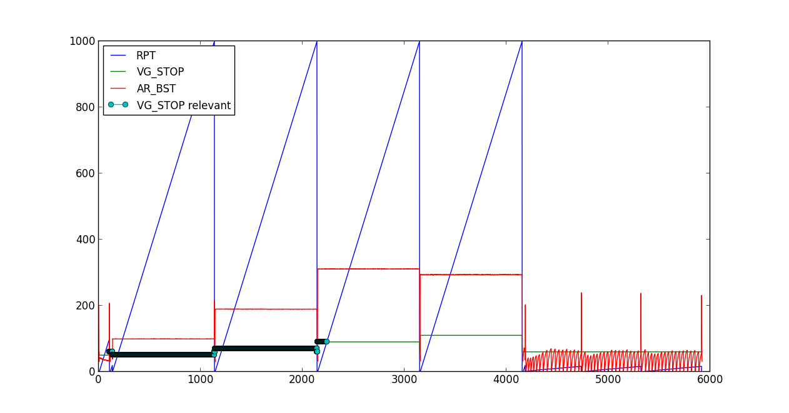

.. I made a back-up of this file temporarily as BAKoverview_examples.rst and I
.. will bring in here section by section from that file and make a test for each
.. thing. So then I can write and test and write some more and test again.

Overview and examples
*********************

The idea behind `channelpack` is to provide a quick and convenient way of
loading and analyzing (test) data.

channelpack requires `numpy <https://pypi.python.org/pypi/numpy>`_, but does not
attempt to install that for you during installation of channelpack. It's not a
huge deal to install numpy, but maybe not trivial either, and there might be
reasons you prefer to do that yourself.

.. automodule:: channelpack

Loading and exploring data files
================================

If your data is numeric and in a text file, the function :func:`~pack.txtpack`
try to be smart and figure out data delimiter, decimal separator, start-row of
data and the channel names::

    >>> import channelpack as cp
    >>> tp = cp.txtpack('testdata/subdir1/MesA1.csv')
    >>> tp
    <channelpack.pack.ChannelPack instance at ...>
    >>> tp.chnames
    {0: 'Time_100Hz', 1: 'P_cyl', 2: 'F_cyl', 3: 'L_cyl', 4: 'Fc1_cal', 5: 'Fc2_cal'}
    >>> tp.chnames_0
    {0: 'ch0', 1: 'ch1', 2: 'ch2', 3: 'ch3', 4: 'ch4', 5: 'ch5'}

The attribute chnames_0 is always available, it is a sort of fall-back if
chnames is not set. If not set, chnames is None.

The ChannelPack objects are made callable::

    >>> tp(1) is tp('P_cyl') is tp('ch1')
    True
    >>> type(tp(1))
    <type 'numpy.ndarray'>

"Channels" enjoy the functionality of numpy arrays::

    >>> tp.rec_cnt
    17665
    >>> tp(0).size
    17665
    >>> tp(0)[tp(0) < 0.10]
    array([ 0.  ,  0.01,  0.02,  0.03,  0.04,  0.05,  0.06,  0.07,  0.08,  0.09])
    >>> tp(0)[tp(0) < 0.10].size
    10

Esoteric
--------

channelpack make use of a humble rc file. If a file exist in
`os.path.expanduser('~')`, with the name
:data:`channelpack.pack.CHANNELPACK_RC_FILE`, being ``.channelpackrc``, it can
have this content::

    [channelpack]
    originextensions = b8b, blob

The originextensions value is a comma separated list of file extensions. The
only functionality from this currently is that two attributes are set::

    >>> tp.mtimefs
    '.../testdata/subdir1/MesA1.blob'
    >>> tp.mtimestamp
    'Thu Apr  2 23:26:36 2015'

given that there was some file with the same base name as the loaded file, but
with an extension as listed in `originextensions` value. The loaded file was::

    >>> tp.filename
    '.../testdata/subdir1/MesA1.csv'

The idea behind this is that the modification time of the original file (if any)
might be the time when some measurement was done, and so this time is made
available. Such a file is only searched for in the same directory as the loaded
file sits in.

Slicing out relevant parts of data
==================================

The channelpack object is basically holding a dict with data and a Boolean mask
(an array of the same length as the channels) to keep track of the condition
state of the object. The mask can be manipulated directly, but for possible
re-use of the condition settings, conditions are given as strings to the
channelpack.

General conditions
------------------

Assume some listing for a plot like this, using your favorite plotting library,
(`matplotlib <http://matplotlib.org/>`_) (assignment to underscores are just to
be able to test those examples with doctest)::

    >>> # listing1
    >>> import matplotlib.pyplot as pp

    >>> import channelpack as cp

    >>> tp = cp.txtpack('testdata/sampledat1.txt')
    >>> _ = pp.figure(figsize=(12.5, 6.5))
    >>> ax1 = pp.subplot(111)

    >>> for n in (0, 3, 4):
    ...     _ = ax1.plot(tp(n), label=tp.name(n))

    >>> prop = {'size': 12}
    >>> _ = ax1.legend(loc='upper left', prop=prop)

    >>> pp.show()

producing an overview plot:

An update of the listing1 listing follows to show conditions to sort out some
relevant parts of data::

   >>> # listing2
   >>> _ = pp.figure(figsize=(12.5, 6.5))
   >>> ax1 = pp.subplot(111)

   >>> for n in (0, 3, 4):
   ...     _ = ax1.plot(tp(n), label=tp.name(n))

   >>> # Add conditions to the channelpack:
   >>> tp.add_condition('cond', '%(RPT) > %(AR_BST)')
   >>> tp.add_condition('cond', '(%(VG_STOP) == 70) |  (%(VG_STOP) == 90)')

   >>> # Make not true sections be replaced by nan's on calls:
   >>> tp.nof = 'nan'

   >>> _ = ax1.plot(tp(4), label=tp.name(4) + ' relevant', marker='x')

   >>> prop = {'size': 12}
   >>> _ = ax1.legend(loc='upper left', prop=prop)

   >>> pp.show()

Setting the `nof` attribute to 'nan' sets the samples not fulfilling the
criteria to numpy.nan, on calls. This is useful when plotting since nans are
nicely handled by matplotlib. In this case, `RPT` need to be bigger than
`AR_BST` and `VG_STOP` need to be either 70 or 90:

The ``nof`` attribute can have the values 'nan', 'filter' or ``None``. If
'filter', the effect is that only the samples with a corresponding True element
in the mask are returned on calls.

To see the current conditions, say::

    >>> tp.pprint_conditions()
    cond1: %(RPT) > %(AR_BST)
    cond2: (%(VG_STOP) == 70) |  (%(VG_STOP) == 90)
    startcond1: None
    stopcond1: None
    stopextend: None
    dur: None
    samplerate: None

The syntax of the conditions is python using numpy arrays. Any expression that
produces a Boolean array. Since the pack is callable, one can say
``tp('VG_STOP') == 70`` to produce such an array. When given as a string, the
identifier for the pack is replaced with ``%``. In the string the quotes around
the channel identifier is optional. To give ``tp('VG_STOP') == 70`` as a
condition string, ``tp.add_condition("cond", "%('VG_STOP') == 70")`` will work.

The different conditions are and:ed together.

Related methods:

* :func:`~channelpack.ChannelPack.add_condition`
* :func:`~channelpack.ChannelPack.clear_conditions`
* :func:`~channelpack.ChannelPack.pprint_conditions`

START and STOP conditions
-------------------------

Often referred to as `start trigger` and `stop trigger` with data acquisition
tools.

Sometimes it is easier to slice out relevant parts by specifying a start and a
stop. This can be done using the same method as above,
:func:`~channelpack.ChannelPack.add_condition`, setting the `conkey` argument to
one of

* 'startcond'
* 'stopcond'

From the record where the start condition(s) are True, the part will remain True
until the condition(s) for stop is True, even though the start conditions might
cease to be True in between.

A similar listing again::

    >>> # listing3
    >>> tp = cp.txtpack('testdata/sampledat1.txt')
    >>> _ = pp.figure(figsize=(12.5, 6.5))
    >>> ax1 = pp.subplot(111)

    >>> for n in (0, 3, 4):
    ...     _ = ax1.plot(tp(n), label=tp.name(n))

    >>> # Add conditions to the channelpack, using start and stop:
    >>> tp.add_condition('startcond', '%(AR_BST) >= 200')
    >>> tp.add_condition('stopcond', '(%(VG_STOP) == 90) & (%(RPT) > %(VG_STOP))')

    >>> # Make not true sections be replaced by nan's on calls:
    >>> tp.nof = 'nan'

    >>> _ = ax1.plot(tp(3), label=tp.name(3) + ' relevant', marker='o')
    >>> prop = {'size': 12}
    >>> _ = ax1.legend(loc='upper left', prop=prop)
    >>> pp.show()

Early in the data, `AR_BST` has a quick peak exceeding 200, a fulfilled start
condition. When `VG_STP` is 90 and `RPT` is bigger than `VG_STOP`, the first
relevant part is defined by a stop condition fulfilled:

Note that the start condition is fulfilled in parallel with the stop condition,
but the stop condition dominate. As soon as the stop condition is not True
anymore, a new start is defined (condition fulfilled). The new start is not
meeting any fulfilled stop condition, and so is valid the rest of data.

A related method is :func:`~channelpack.ChannelPack.set_stopextend`. For cases
when some extra elements should be added to the end of the start-stop part.

Duration conditions
-------------------

Consider the listing3 listing above and the plot. A new start happened after the
first part had been defined. This was maybe not desired and could obviously be
avoided by playing further with conditions. But at times it might be easier to
set a duration rule.

    >>> tp('VG_STOP', 0).size
    2133
    >>> tp('VG_STOP', 1).size
    2766
    >>> tp('VG_STOP', 2).size
    Traceback (most recent call last):
    ...
    IndexError: list index out of range

An un-mentioned feature sneaked in, see the
:func:`~channelpack.ChannelPack.__call__` signature for docs. Anyway, two
relevant parts was defined by the start-stop conditions, and they can be
retrieved respectively by enumeration this way. Now I know the length of each
part, and add a duration rule to the pack to exclude the second part::

    >>> # listing4
    >>> _ = pp.figure(figsize=(12.5, 6.5))
    >>> ax1 = pp.subplot(111)

    >>> tp.nof = None   # discard the current conditions on first plot
    >>> for n in (0, 3, 4):
    ...     _ = ax1.plot(tp(n), label=tp.name(n))

    >>> # Add a duration rule:
    >>> tp.set_duration('dur < 2766')

    >>> # Make not true sections be replaced by nan's on calls:
    >>> tp.nof = 'nan'

    >>> _ = ax1.plot(tp(3), label=tp.name(3) + ' relevant', marker='o')
    >>> prop = {'size': 12}
    >>> _ = ax1.legend(loc='upper left', prop=prop)
    >>> pp.show()

    >>> tp.pprint_conditions()
    cond1: None
    startcond1: %(AR_BST) >= 200
    stopcond1: (%(VG_STOP) == 90) & (%(RPT) > %(VG_STOP))
    stopextend: None
    dur: dur < 2766
    samplerate: None

And a new plot to show off the difference:

Related methods:

* :func:`~channelpack.ChannelPack.set_duration`
* :func:`~channelpack.ChannelPack.set_sample_rate`
* :func:`~channelpack.ChannelPack.__call__`

Spitting and eating persistant state of conditions
==================================================

As seen above, details on the condition setting can be reviewed interactively
by:

    >>> tp.pprint_conditions()
    cond1: None
    startcond1: %(AR_BST) >= 200
    stopcond1: (%(VG_STOP) == 90) & (%(RPT) > %(VG_STOP))
    stopextend: None
    dur: dur < 2766
    samplerate: None

Oftentimes, conditions are played with interactively until a setting satisfying
the needs is found. It can also be so that the setting will work equally well
with some other data file, because the structure of the data is the same, as
well as the channel names. In this case it might be convenient to store away the
settings found out:

    >>> tp.spit_config()

The command spits a file to the directory where the loaded data file sits by
default. It look like this:

.. literalinclude:: ../testdata/conf_file.cfg

And is given by default the name ``conf_file.cfg``.

When this is done, setting the same conditions on a similar data file again is
easy, if :func:`~channelpack.ChannelPack.eat_config` is used. If to eat_config a
file with a name other than ``conf_file.cfg``, the name is given as an argument.
But now just eat the default file::

   >>> # listing5
   >>> tp = cp.txtpack('testdata/sampledat2.txt')
   >>> tp.pprint_conditions()
   cond1: None
   startcond1: None
   stopcond1: None
   stopextend: None
   dur: None
   samplerate: None

   >>> # Eat a conf_file sitting in the same directory as the data file:
   >>> tp.eat_config()
   >>> tp.pprint_conditions()
   cond1: None
   startcond1: %(AR_BST) >= 200
   stopcond1: (%(VG_STOP) == 90) & (%(RPT) > %(VG_STOP))
   stopextend: None
   dur: dur < 2766
   samplerate: None

And so the condition settings don't have to be figured out again.

The ``conf_file.cfg`` can be used to customize the channel names and / or
experimenting with the conditions. The work flow could look like this:

    >>> tp = cp.txtpack('testdata/sampledat1.txt')
    >>> tp.chnames
    {0: 'RPT', 1: 'B_CACT', 2: 'P_CACT', 3: 'VG_STOP', 4: 'AR_BST', 5: 'PLRT_1', 6: 'TOQ_BUM'}
    >>> tp.pprint_conditions()
    cond1: None
    startcond1: None
    stopcond1: None
    stopextend: None
    dur: None
    samplerate: None
    >>> tp.spit_config('testdata/conf_file_mod.cfg')

Open the spitted file, make some work and save it (the following is dummy code
to modify the spitted file during doctests of these examples, don't let it
disturb)::

    >>> import os
    >>> ret = os.system('make modconf')

And the modified file is this:

.. literalinclude:: ../testdata/conf_file_mod.cfg

Then eat the file and changes are applied:

   >>> tp.eat_config() # associated with the modified file thanks to the spit
   >>> tp.chnames
   {0: 'RPT_mod',
    1: 'B_CACT_mod',
    2: 'ABC_mod',
    3: 'DEF_mod',
    4: 'AR_BST_mod',
    5: 'PLRT_1_mod',
    6: 'TOQ_BUM_mod'}

   >>> tp.pprint_conditions()
   cond1: (%(RPT_mod) > 250)
   startcond1: None
   stopcond1: None
   stopextend: None
   dur: None
   samplerate: None

Related methods:

* :func:`~channelpack.ChannelPack.spit_config`
* :func:`~channelpack.ChannelPack.eat_config`

Stripping "channel" names
-------------------------

The :func:`~channelpack.ChannelPack.name` method is maybe worth a mention. It has
some tricks to fiddle with the name returned. Consider this example:

    >>> tp = cp.txtpack('testdata/dat_0000.txt')
    >>> tp.name(0)
    'Time [s]'
    >>> tp.name(1)
    'Quantity1 - 12345678;  [qunit]'
    >>> tp.name(2)
    'Distance - 12345678;  [mm]'
    >>> tp.name(3)
    'Stresslevel& - 12345678;  [kLevel]'

Sometimes names look like that. Fiddle with the name:

    >>> tp.name(0, firstwordonly=True)
    'Time'
    >>> tp.name(1, firstwordonly=True)
    'Quantity1'
    >>> tp.name(1, firstwordonly=r'[A-Za-z]+')
    'Quantity'
    >>> tp.name(3, firstwordonly=r'\w+')
    'Stresslevel'

The same keyword (`firstwordonly`) exist also for the `spit_config` method, so
names can be stripped also to the spitted file. But names in the pack are not
modified until an eat_config is done.

Related methods:

* :func:`~channelpack.ChannelPack.name`
* :func:`~channelpack.ChannelPack.spit_config`
* :func:`~channelpack.ChannelPack.eat_config`
