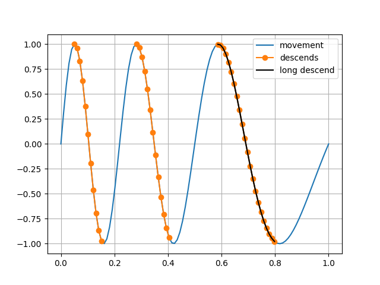

Overview and examples
*********************

There is nothing special or magic about the ChannelPack class, it is a
wrapper class for a dict of data and a dict of "channel" names. Those
dict attributes, `data` and `chnames` are a little special -- they
both require integer keys and the `data` dict will convert sequence
values to Numpy arrays if not arrays already. And the `data` dict will
error if any resulting array is not 1-dimensional.

The 1-dimensional requirement reflects a view of the ChannelPack
object as a holder of flat file data columns.

The integer keys in respective dict are supposed to align to be able
to refer to arrays by name.

Make an object
==============

ChannelPack takes zero or one dict for data and zero or one dict for
names to initialize.

Produce some data and make a pack
---------------------------------

    >>> import channelpack as cp
    >>> data = {0: range(5), 1: ('A', 'B', 'C', 'D', 'E')}
    >>> names = {0: 'seq', 1: 'abc'}
    >>> pack = cp.ChannelPack(data=data, chnames=names)
    >>> pack
    ChannelPack(
    data={0: array([0, 1, 2, 3, 4]),
          1: array(['A', 'B', 'C', 'D', 'E'], dtype='<U1')},
    chnames={0: 'seq',
             1: 'abc'})
    >>> pack(0)
    array([0, 1, 2, 3, 4])
    >>> pack(0) is pack('seq')
    True

Slicing out relevant parts of data
==================================

Support for slicing and filtering is provided by a Boolean mask in the
pack and a `nof` argument in calls. In calls to get at data, the mask
is consulted to return parts of the data with corresponding True parts
in the mask.

The mask attribute
------------------

The mask in the pack is set by using bitwise operator comparisons on
Numpy arrays, resulting in a Boolean array::

    >>> pack.mask = (pack('seq') < 2) | (pack('abc') == 'D')
    >>> pack('seq', part=0)
    array([0, 1])
    >>> pack('seq', part=1)
    array([3])
    >>> pack('abc', nof='filter')
    array(['A', 'B', 'D'], dtype='<U1')
    >>> pack('abc', nof='nan')
    array(['A', 'B', None, 'D', None], dtype=object)
    >>> pack('seq', nof='nan')
    array([ 0.,  1., nan,  3., nan])

- The `part` argument refer to a contiguous True part of the mask,
  enumerated from 0. With all elements or only one part True in the
  mask there is one part == 0. This argument overrides the `nof`
  argument.
- With `nof='filter'`, a possibly shorter version of data is returned
  depending on the mask.
- With `nof='nan'`, the data length is the same as original array but
  with corresponding non-true elements in mask replaced with np.nan or
  None depending the type.

Start,  stop and duration
-------------------------

Sometimes it is easier to think of parts as beginning at some
condition or event and stopping at some other. A method
:meth:`~channelpack.ChannelPack.startstop` is supporting something
like a "start and stop trigger".

Imagine some alternating movement over time that is slowing down::

    >>> import numpy as np
    >>> import matplotlib.pyplot as pp
    >>> t = np.linspace(0, 1, 100)  # (samplerate 100)
    >>> f = 5.0
    >>> movement = np.sin(2 * np.pi * (f - 2 * t) * t)
    >>> pack = cp.ChannelPack({0: t, 1: movement}, {0: 'time', 1: 'movement'})
    >>> # Plot the whole movement
    >>> _ = pp.plot(pack('time'), pack('movement'), label='movement');

Say that the descending slopes are of particular interest::

    >>> startb = pack('movement') > 0.98
    >>> stopb = pack('movement') < -0.98
    >>> _ = pack.startstop(startb, stopb)
    >>> # plot only the descends
    >>> _ = pp.plot(pack('time'), pack('movement', nof='nan'),
    ...             label='descends', marker='o')

A method :meth:`~channelpack.ChannelPack.duration` can be used to
make false any true parts that is not long enough. Filter out the
shorter slopes::

    >>> _ = pack.duration(0.15, samplerate=100)
    >>> # plot only the remaining descend
    >>> _ = pp.plot(pack('time'), pack('movement', nof='nan'),
    ...             label='long descend', color='black')
    >>> # show it
    >>> pp.grid()
    >>> _ = pp.legend(loc='upper right'); pp.show()

Factory functions to get a pack
===============================

A few factory functions are provided to create a pack from data files.

Text
----

Data stored in readable text files in the form of delimited data
fields, (csv, txt). Fields might be numbers or text.

:func:`~channelpack.textpack`

If data is numeric only, a lazy variant is available

:func:`~channelpack.textpack_lazy`

Spread sheet
------------

The library `xlrd` is used, so xls and xlsx types of spread sheets are
supported.

:func:`~channelpack.sheet_pack`

Xbase DBF format
----------------

Legacy kind of data base format.

:func:`~channelpack.dbfpack`

Normal File Format (.NORM)
--------------------------

Currently not supported.

