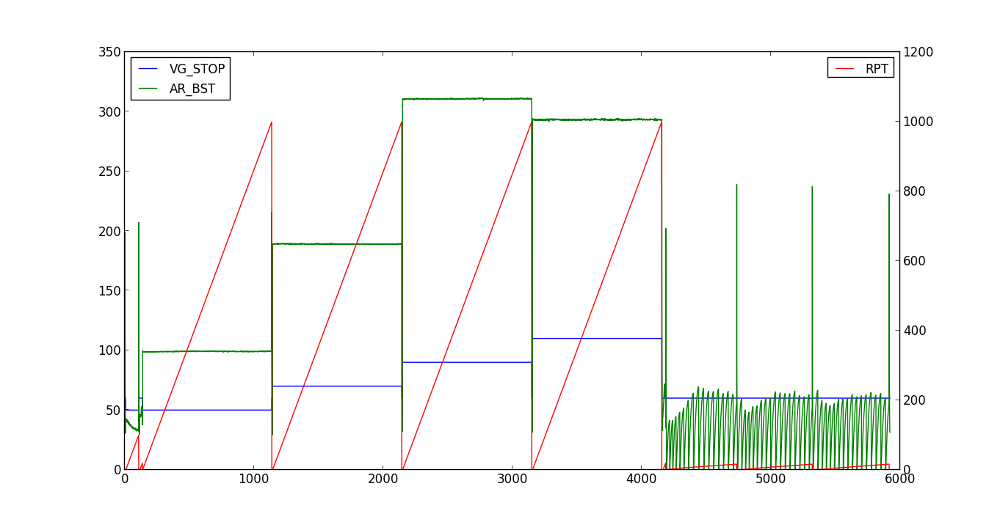

Overview and examples
*********************

The idea behind `channelpack` is to provide a quick and convinient way of
loading and anlyzing (test) data.

channelpack requires `numpy <https://pypi.python.org/pypi/numpy>`_, but does not
attempt to install that for you during installation of channelpack. It's not a
huge deal to install numpy, but maybe not trivial either, and there might be
reasons you prefer to do that yourself.

.. automodule:: channelpack

The function :func:`~pack.txtpack` try to determine delimiters and possible
"channel" names and start of data automatically, but this works only if data is
numerical. There is no limitation of the :class:`~channelpack.ChannelPack` class
for the data it holds - the arrays are numpy 1d arrays.

Loading and exploring data files
================================

.. note:: to myself

   Examples of loading files. Load a file. Have some original file in the same
   directory.

   Show how to see channel names, the back-up names. How to retreive data
   channels. Show how they can be operated on as numpy objects.

If your data is numeric and in a textfile, the function `txtpack` try to be
smart and figure out data delimiter, decimal separator, start-row of data and
the channel names::

    >>> import channelpack as cp
    >>> tp = cp.txtpack('MesA1.csv')
    >>> tp
    <channelpack.pack.ChannelPack instance at 0xb6202eac>
    >>> tp.chnames
    {0: 'Time_100Hz', 1: 'P_cyl', 2: 'F_cyl', 3: 'L_cyl', 4: 'Fc1_cal', 5: 'Fc2_cal'}
    >>> tp.chnames_0
    {0: 'ch0', 1: 'ch1', 2: 'ch2', 3: 'ch3', 4: 'ch4', 5: 'ch5'}

The attribute chnames_0 is always available, it is a sort of fall-back if
chnames is not set. If not set, chnames is None.

The ChannelPack objects are made callable::

    >>> tp(1) is tp('P_cyl') is tp('ch1')
    True
    >>> type(tp(1))
    <type 'numpy.ndarray'>

"Channels" enjoy the functionality of numpy arrays::

    >>> tp.rec_cnt
    17665
    >>> tp(0).size
    17665
    >>> tp(0)[tp(0) < 0.10]
    array([ 0.  ,  0.01,  0.02,  0.03,  0.04,  0.05,  0.06,  0.07,  0.08,  0.09])
    >>> tp(0)[tp(0) < 0.10].size
    10

Esoteric
--------

.. note:: to myself

   Describe the mtimefs and mtimestamp thing. Esoteric might be a cool header,
   making clear that this might be of interrest for only a few.

channelpack make use of a humble rc file. If a file exist in
`os.path.expanduser('~')`, with the name
:data:`channelpack.pack.CHANNELPACK_RC_FILE`, being ``.channelpackrc``, it can
have this content::

    [channelpack]
    originextensions = b8b, blob

The originextensions value is a comma separated list of file extensions. The
only functionality from this currently is that two attributes are set::

    >>> tp.mtimefs
    '/path/to/data/MesA1.blob'
    >>> tp.mtimestamp
    'Tue Sep  9 23:00:04 2014'

given that there was some file with the same base name as the loaded file, but
with an extension as listed in `originextensions` value. The loaded file was::

    >>> tp.filename
    '/path/to/data/MesA1.csv'

The idea behind this is that the modification time of the original file (if any)
might be the time when some measurement was done, and so this time is made
available. Such a file is only searched for in the same directory as the loaded
file sits in.

Slicing out relevant parts of data
==================================

.. note:: to myself

   Examples of conditions. Spitting and eating conditions from a conf_file
   file. Use data in /home/tomas/pyfiles/channelpack/testdata/1380/

   * 6 = RPT        Show this on ax2, rest on ax1
   * 7 = B_CACT     
   * 9 = P_CACT
   * 12 = BASE
   * 14 = VG_STOP   Show
   * 25 = AR_BST    Make this or
   * 27 = PLRT_1
   * 33 = TOQ_BUM

   A tuple of numbers: (6, 7, 9, 12, 14, 25, 27, 33)
   Put condition RPT > AR_BST and then show VG_STOP on plot by masking. Also
   show how filter works and that it gives arrays of reduced size.

Assume a dbf file with some of the channel names (columns) of interrest::

    >>> dp = cp.dbfpack('mesdat.dbf', (6, 7, 9, 12, 14, 25, 27, 33))
    >>> dp.chnames
    {33: 'TOQ_BUM', 6: 'RPT', 7: 'B_CACT', 9: 'P_CACT', 12: 'BASE', 14: 'VG_STOP', 25: 'AR_BST', 27: 'PLRT_1'}
    >>> dp.chnames_0
    {33: 'ch33', 6: 'ch6', 7: 'ch7', 9: 'ch9', 12: 'ch12', 14: 'ch14', 25: 'ch25', 27: 'ch27'}

.. note:: The chnames and chnames_0 attributes are currently dicts, but will be
   ordered dicts in a coming update. That should give nicer interactive output
   (channels in order).

Using your favourite plotting library, (`matplotlib <http://matplotlib.org/>`_),
make a script and plot some channels::

    # plotit1.py

    import matplotlib.pyplot as pp

    import channelpack as cp

    dp = cp.dbfpack('mesdat.dbf', (6, 7, 9, 12, 14, 25, 27, 33))
    dp.eat_config()                 # Don't show

    pp.figure(figsize=(12.5, 6.5))

    ax1 = pp.subplot(111)

    for n in (6, 14, 25):
        ax1.plot(dp(n), label=dp.name(n))

    prop = {'size': 12}
    ax1.legend(loc='upper left', prop=prop)

    pp.show()

code debug rst::

    # plotit1.py

    import matplotlib.pyplot as pp

    import channelpack as cp

    dp = cp.dbfpack('mesdat.dbf', (6, 7, 9, 12, 14, 25, 27, 33))
    dp.eat_config()                 # Don't show

    pp.figure(figsize=(12.5, 6.5))

    ax1 = pp.subplot(111)

    for n in (6, 14, 25):
        ax1.plot(dp(n), label=dp.name(n))

    prop = {'size': 12}
    ax1.legend(loc='upper left', prop=prop)
    ax2.legend(loc='upper right', prop=prop)

    pp.show()

Rewrite above. See plotit2.py

Fantastic

AND and OR conditions
---------------------

Basic conditions

START and STOP conditions
-------------------------

Often referred to as `start trigger` and `stop trigger` with data acqusition
tools.

Duration conditions
-------------------

When given conditions is not enough.

Spitting and eating a file
==========================

Store the conditions figured out for later use with a data file with the same
lay-out.

Stripping "channel" names
-------------------------

Explain usage of `firstwordonly` keyword argument. Especially when spitting.
