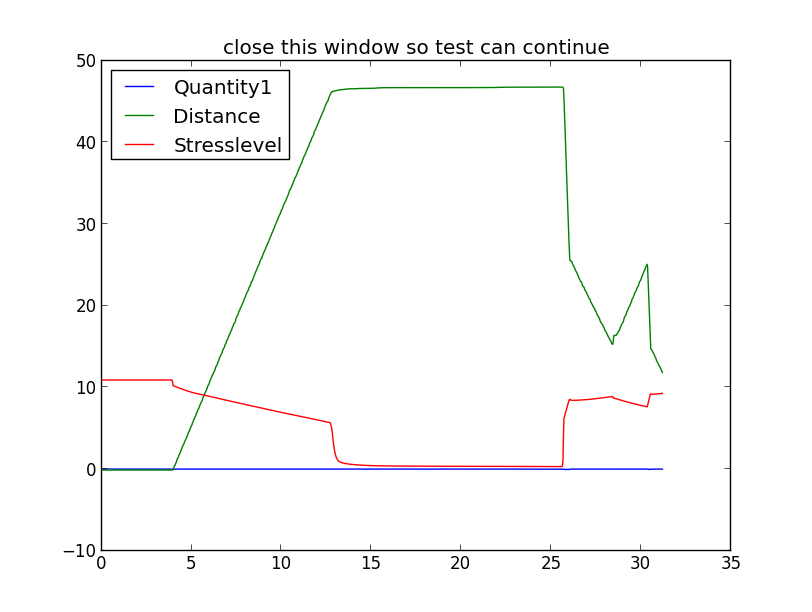
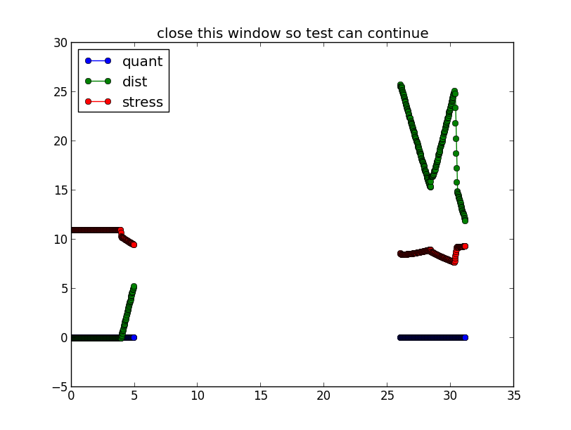
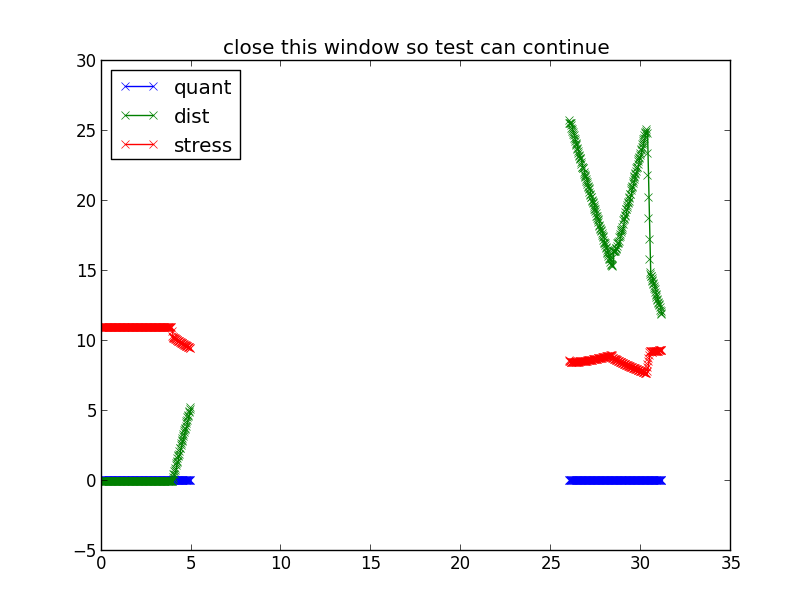
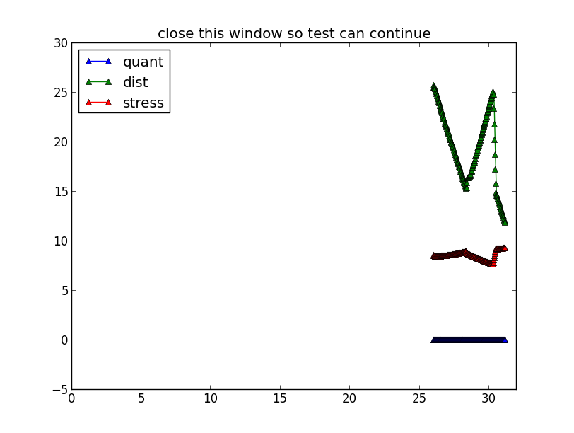
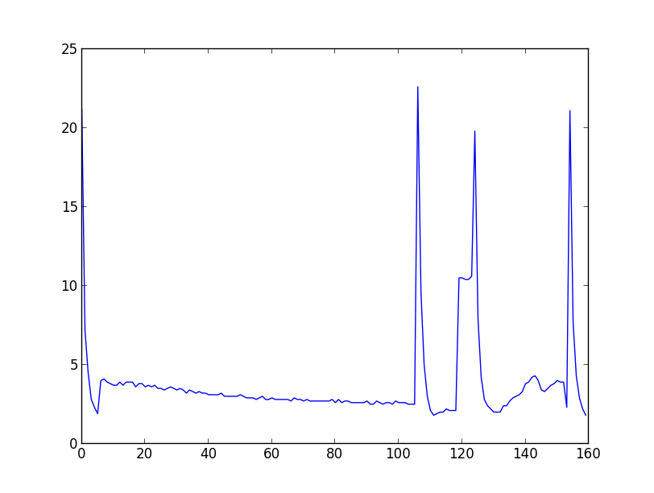
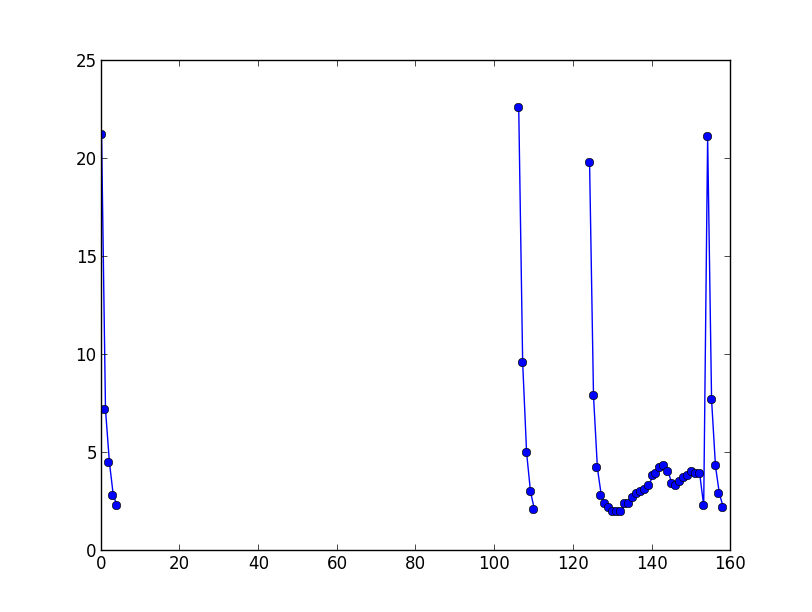

Testable examples
*****************

Those examples are made up mainly for testing, (doctest). Hopefully there is
enough prose so it can also be some help to understand the channelpack.

Load and plot
=============

Load a data file and make some plots with presentable legends::

    >>> import channelpack as cp
    >>> tp = cp.txtpack('testdata/dat_0000.txt')
    DEBUG: rts was adjusted with 1
    >>> sorted(tp.chnames.items())
    [(0, 'Time [s]'),
     (1, 'Quantity1 - 12345678;  [qunit]'),
     (2, 'Distance - 12345678;  [mm]'),
     (3, 'Stresslevel& - 12345678;  [kLevel]')]
    >>> from matplotlib.pyplot import *
    >>>
    >>> for n in tp.chnames.keys()[1:]:
    ...     plot(tp(0), tp(n), label=tp.name(n, firstwordonly='\w+'))
    ...
    [<matplotlib.lines.Line2D object at ...
    [<matplotlib.lines.Line2D object at ...
    [<matplotlib.lines.Line2D object at ...

    >>> legend(loc='upper left')
    <matplotlib.legend.Legend object at ...

    >>> title('close this window so test can continue')
    <matplotlib.text.Text object at ...

    >>> show()

A plot function
===============

Make a def so it can be called for the following experiments::

    >>> def plotit(marker='', first=False):
    ...     for n in tp.chnames.keys()[1:]:
    ...         plot(tp(0), tp(n), label=tp.name(n, firstwordonly=first),
    ...              marker=marker)
    ...     xlim(left=0)
    ...     legend(loc='upper left')
    ...     title('close this window so test can continue')
    ...     show()
    ...

Change channel names
====================

Channel names are easily updated by a call to
:meth:`~channelpack.ChannelPack.set_channel_names`::

    >>> tp.set_channel_names(('time', 'quant', 'dist', 'stress'))
    >>> sorted(tp.chnames.items())
    [(0, 'time'), (1, 'quant'), (2, 'dist'), (3, 'stress')]
    >>> tp.set_channel_names(('time', 'quant', 'dist', 'stress', 'onetoomany'))
    Traceback (most recent call last):
    ...
    ValueError: len(names) != len(self.D.keys())

There is an attribute called ``chnames_0`` which is always available, the
attribute ``chnames`` can be None if there was no custom names found::

    >>> sorted(tp.chnames_0.items())
    [(0, 'ch0'), (1, 'ch1'), (2, 'ch2'), (3, 'ch3')]

Adding conditions
=================

The pack is holding a mask that can be manipulated directly. But one can also
set the state of the pack by adding conditions that can be stored to a file
later for repeats::

    >>> tp.add_condition('cond', '(%(time) > 26) | (%(0) < 5)')
    >>> tp.pprint_conditions()
    cond1: (%(time) > 26) | (%(0) < 5)
    startcond1: None
    stopcond1: None
    stopextend: None
    duration: None
    samplerate: None

Note that in the condition string it is optional to surround the channel name
with quotes. See :meth:`~channelpack.ChannelPack.add_condition`. The condition
above could also have been stated as::

    >>> tp.add_condition('cond', '(%("time") > 26) | (%(0) < 5)')
    >>> tp.pprint_conditions()
    cond1: (%(time) > 26) | (%(0) < 5)
    cond2: (%("time") > 26) | (%(0) < 5)
    startcond1: None
    stopcond1: None
    stopextend: None
    duration: None
    samplerate: None

The added cond2 is the same as cond1. Conditions are and-ed together so cond2 has
no effect. Remove it::

    >>> tp.clear_conditions('cond2')
    >>> tp.pprint_conditions()
    cond1: (%(time) > 26) | (%(0) < 5)
    cond2: None
    startcond1: None
    stopcond1: None
    stopextend: None
    duration: None
    samplerate: None

Anything that can be done for producing Boolean results with numpy arrays can be
done here where the identifier for the pack is replaced with ``%``.

Now replace all corresponding false elements with numpy.nan and plot it::

    >>> tp.nof = 'nan'
    >>> plotit(marker='o')

Make a rule for the duration of the condition, invalidating the early part::

    >>> tp.set_duration('dur > 5')
    >>> tp.pprint_conditions()
    cond1: (%(time) > 26) | (%(0) < 5)
    cond2: None
    startcond1: None
    stopcond1: None
    stopextend: None
    duration: dur > 5
    samplerate: None

    >>> plotit(marker='x')

That didn't work out because the sample rate defaults to 1 if not set. One
cannot guess::

    >>> tp.set_samplerate(40)
    >>> tp.pprint_conditions()
    cond1: (%(time) > 26) | (%(0) < 5)
    cond2: None
    startcond1: None
    stopcond1: None
    stopextend: None
    duration: dur > 5
    samplerate: 40

    >>> plotit(marker='^')

Persist the state of the pack for another similar data set
==========================================================

Once the conditions required are sorted out, the state can be stored away in a
file. channelpack call this to do a
:meth:`~channelpack.ChannelPack.spit_config`::

    >>> tp.spit_config()

Now get a new pack::

    >>> tp = cp.txtpack('testdata/dat_0000.txt')
    DEBUG: rts was adjusted with 1
    >>> tp.pprint_conditions()
    cond1: None
    startcond1: None
    stopcond1: None
    stopextend: None
    duration: None
    samplerate: None

    >>> tp.eat_config() # Eats by default from directory where the data file is.
    >>> tp.pprint_conditions()
    cond1: (%(time) > 26) | (%(0) < 5)
    cond2: None
    startcond1: None
    stopcond1: None
    stopextend: None
    duration: dur > 5
    samplerate: 40

More on the mask, parts and conditions
======================================

Load a dbf file ::

    >>> dp = cp.dbfpack('testdata/mesdat2.dbf')
    >>> dp.rec_cnt
    4191
    >>> c = dp.counter('YESNO')
    >>> c.most_common()
    [('No ', 4189), ('Yes', 2)]

See :meth:`~channelpack.ChannelPack.counter` and see some more stuff too. The
mask can be manipulated directly if desired::

    >>> dp.mask = dp('YESNO') == 'Yes'
    >>> dp.slicelist()
    [slice(135, 136, None), slice(4184, 4185, None)]
    >>> dp.parts()
    [0, 1]
    >>> dp('YESNO', 0)
    array(['Yes'],
          dtype='|S3')
    >>> dp('YESNO', 1)
    array(['Yes'],
          dtype='|S3')

When adding a condition by channelpack features, the mask is made from scratch
on the conditions::

    >>> dp.add_condition('cond', '(%(LINENO) < 120) | (%(LINENO) > 4150)')

    >>> dp.pprint_conditions()
    cond1: (%(LINENO) < 120) | (%(LINENO) > 4150)
    startcond1: None
    stopcond1: None
    stopextend: None
    duration: None
    samplerate: None

    >>> dp.parts()
    [0, 1]

    >>> dp.slicelist()
    [slice(0, 119, None), slice(4150, 4191, None)]

    >>> dp('LINENO')[4190]
    4190.0

    >>> dp('LINENO')[4150]
    4151.0

Load a new one::

    >>> dp = cp.dbfpack('testdata/mesdat3.dbf')

Set some conditions, study the start and stop feature::

    >>> dp.add_condition('start', '%(BDIST) > 19')
    >>> dp.add_condition('stop', '%(BDIST) < 2')
    >>> dp.pprint_conditions()
    cond1: None
    startcond1: %(BDIST) > 19
    stopcond1: %(BDIST) < 2
    stopextend: None
    duration: None
    samplerate: None

But that was wrong, it should have been 'BTIME'. Either clear the conditions
:meth:`~channelpack.ChannelPack.clear_conditions`, or add with a specific
condition::

    >>> dp.add_condition('startcond1', '%(BTIME) > 19')
    >>> dp.add_condition('stopcond1', '%(BTIME) < 2')
    >>> dp.pprint_conditions()
    cond1: None
    startcond1: %(BTIME) > 19
    stopcond1: %(BTIME) < 2
    stopextend: None
    duration: None
    samplerate: None

Plot without any effect of the conditions::

    >>> plot(dp('BTIME'))
    [<matplotlib.lines.Line2D ...
    >>> show()

It is not always obvious how to set conditions so that only the down-going slopes
are extracted, but the start and stop conditions should yield just that::

    >>> dp.nof = 'nan'
    >>> plot(dp('BTIME'), marker='o')
    [<matplotlib.lines.Line2D ...
    >>> show()

Support functions in pullxl for dates
=====================================

The pullxl module has helper functions to convert dates from python datetimes to
xlstyle of dates, and back::

    >>> sp = cp.sheetpack('testdata/sampledat4.xls', stopcell='d6')
    >>> sp.query_names('*es')
    (3, u'dates')

    >>> sp(3)
    array([datetime.datetime(2010, 10, 1, 0, 0),
           datetime.datetime(2015, 4, 5, 0, 0),
           datetime.datetime(2015, 4, 5, 0, 0),
           datetime.datetime(2015, 4, 5, 0, 0),
           datetime.datetime(2008, 1, 16, 0, 0)], dtype=object)

    >>> xldates = [cp.pullxl.toxldate(dt) for dt in sp(3)]

    >>> xldates # days since 1904
    [38990.0, 40637.0, 40637.0, 40637.0, 38001.0]

    >>> [cp.pullxl.fromxldate(days) for days in xldates]
    [datetime.datetime(2010, 10, 1, 0, 0),
     datetime.datetime(2015, 4, 5, 0, 0),
     datetime.datetime(2015, 4, 5, 0, 0),
     datetime.datetime(2015, 4, 5, 0, 0),
     datetime.datetime(2008, 1, 16, 0, 0)]
